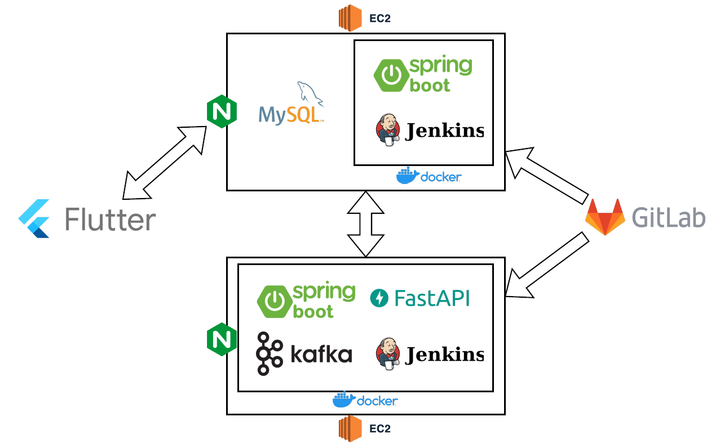
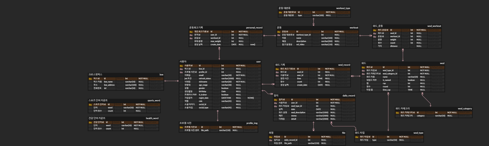
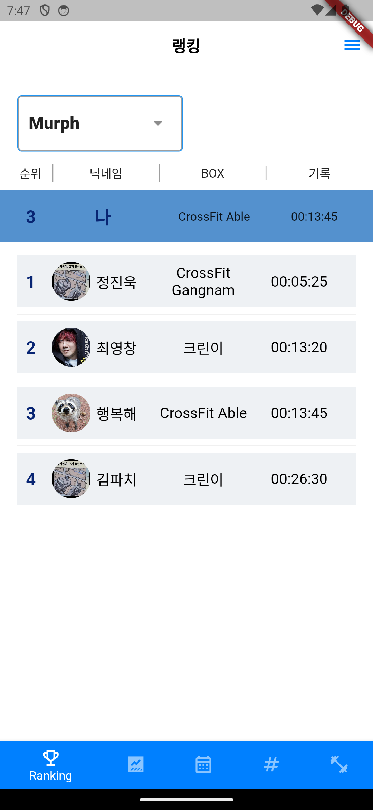
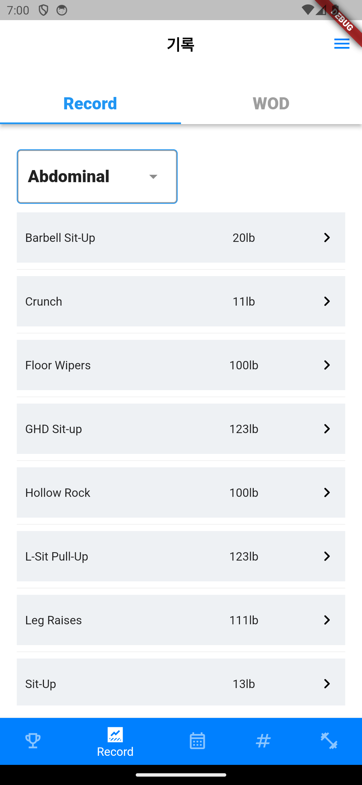
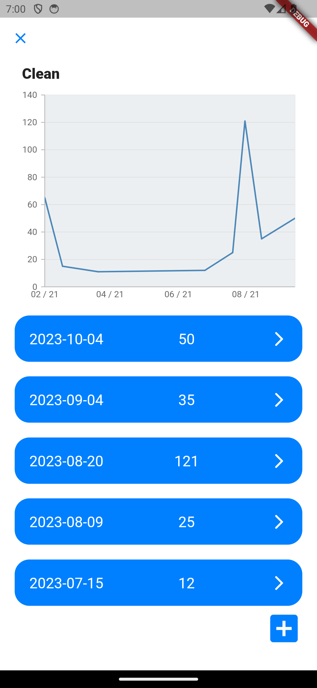
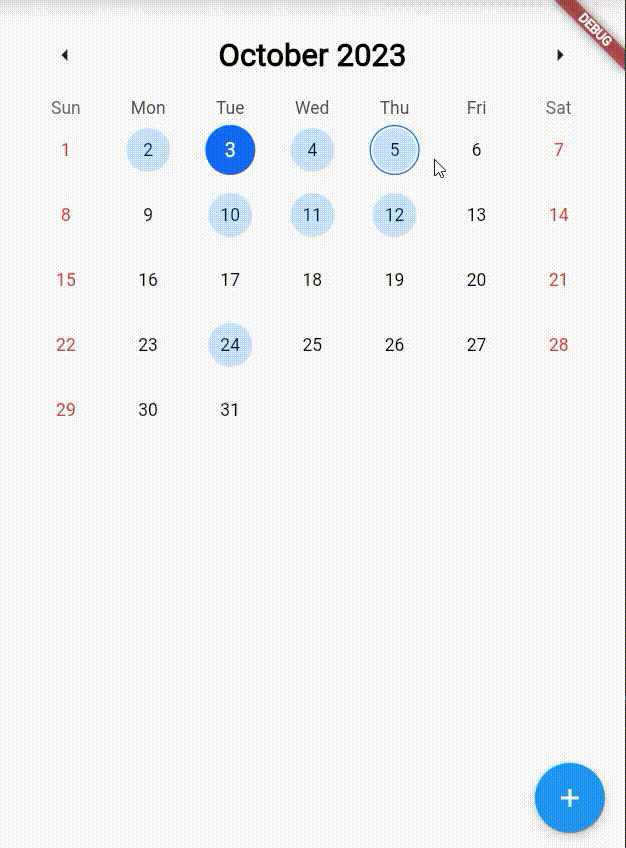
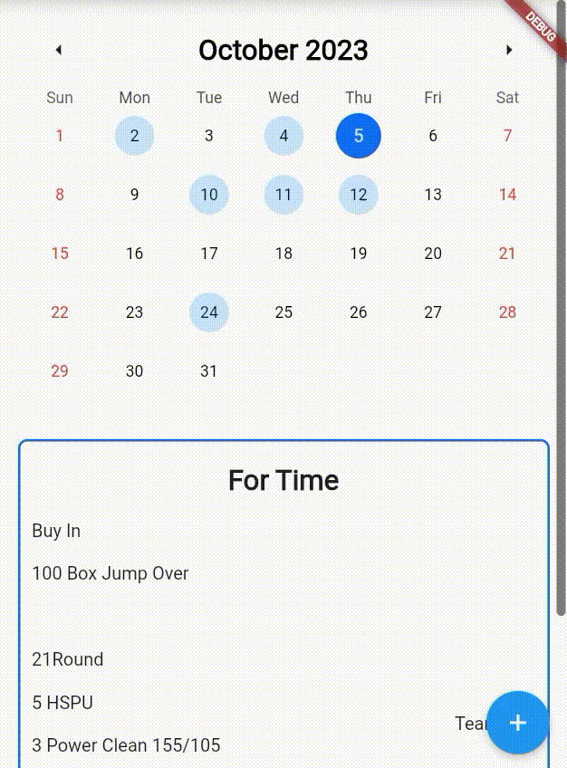
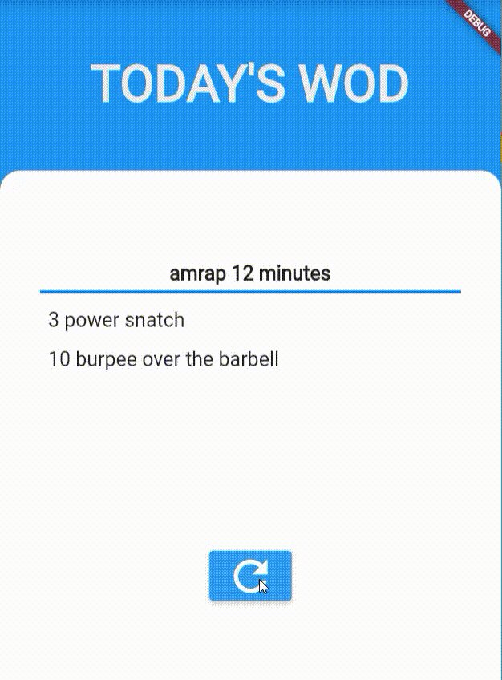
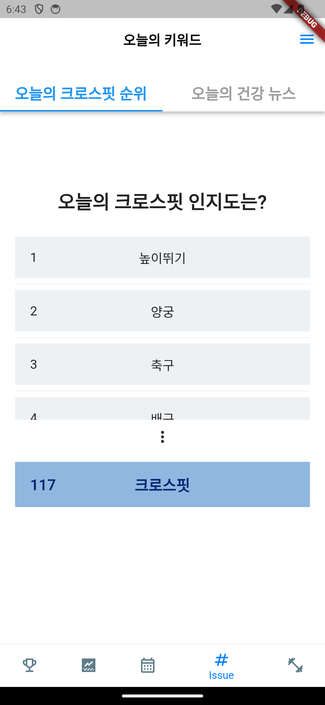
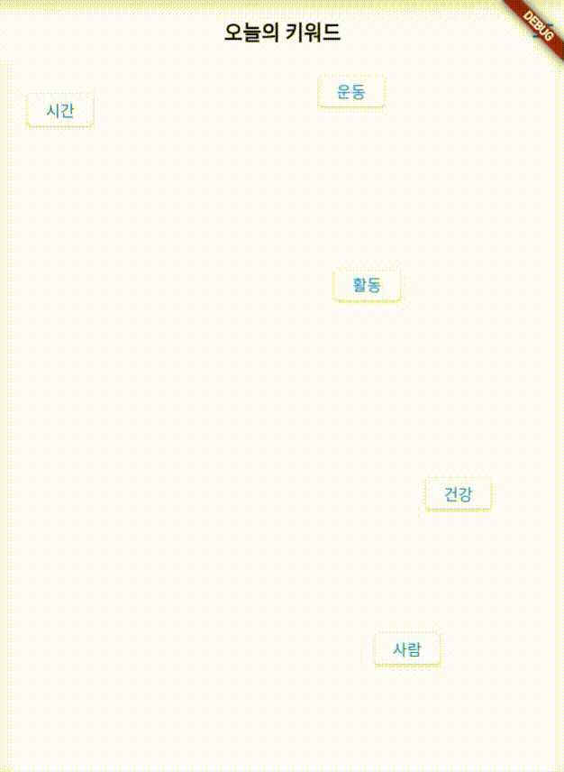

# FITTER - 크로스핏 보조 어플리케이션

- SSAFY 특화 프로젝트 : 빅데이터 분산

## 기획의도

---

- 우리의 기획 의도는 크로스핏 열정을 공유하고 성장을 지원하는 데 초점을 맞춥니다.
- 크로스핏 어플리케이션은 크로스핏 커뮤니티를 위한 필수 도구로, 시장에 존재하지 않는 크로스핏 전용 어플리케이션으로, 다양한 크로스핏 운동 루틴과 개인화된 기능을 통해 사용자들의 운동 경험을 더욱 향상시킬 것입니다.
- 랭킹 시스템을 통해 경쟁과 성취감을 부각시키고, 사용자들은 운동을 더욱 즐기며 목표를 달성할 수 있을 것입니다.
- 이 어플리케이션은 크로스핏을 사랑하는 이들을 연결하고, 자신의 크로스핏 여정을 기록하며 성장하는 데 도움을 주기 위해 탄생했습니다.

## 아키텍처 & ERD

---

- ## 🖥️ 개발 환경

---

- 🛠 **Backend**
  
  
  
  
  
  

- 🛠 **Frontend**

  

- 🛠 **Infra**
  
  
  

- 🛠 **Collaboration**
  
  
  
  

## 주요 기능

---

1. **소셜 로그인** : FITTER는 카카오 계정을 통한 소셜 로그인 기능을 지원합니다. 카카오 계정을 통해 별도의 회원가입 없이 서비스를 이용 할 수 있습니다.

|  |  |
| ------------------------------------------------------------------------------------- | ------------------------------------------------------------------------------------- |

2. **랭킹 시스템**: 네임드 와드의 기록을 통해 랭킹을 생성하여 사용자들은 현재 자신의 수준을 확인하고 다른 사용자와 경쟁하여 동기부여를 얻을 수 있습니다.
   
   |  |
   | --------------------------------------------------------------------------------------------- |

3. **개인 최고 기록 (1RM) 기능**: 사용자들은 자신의 최고 1RM 기록을 어플리케이션에 기록할 수 있어서 성장과 발전을 추적할 수 있습니다.

|  |  |
| ------------------------------------------------------------------------------------- | ------------------------------------------------------------------------------------- |

4. **캘린더를 통한 기록 기능 :** 캘린더를 통해서 해당 일의 운동에 대한 기록과 일기를 기록하고 확인 할 수 있습니다.

|  |   |
| -------------------------------------------------------- | ------------------------------------------------------ |

5. **와드 제네레이터 기능 :** 사용자들은 크로스핏 박스에서 수집된 와드들로 학습된 인공지능 (char-rnn) 을 통해 생성된 와드를 추천 받을 수 있습니다.

|  |
| --------------------------------------------------------------------------------------------------------------------------------------- |

6. **키워드를 통한 뉴스 추천** : 사용자에게 하루에 5가지 키워드가 업데이트 됩니다. 키워드를 누르면 키워드와 관련한 뉴스기사를 제공 받습니다.

|  |  |
| -------------------------------------------------------------------------------------------------------------------------------- | -------------------------------------------------------------------------------------------- |
